# **Music Aid : Songbook**
[‘Music Aid : Songbook’]( https://music-aid.herokuapp.com/) is a website based application, (hosted on [Heroku](https://www.heroku.com/) and implemented with the aid of the Python Django framework), for musicians and songwriters who want a more efficient way to manage their songs than the traditional method of using a folder overflowing with printouts.

Over time songbooks become full and unwieldy. Gathering songs together for a particular gig can be time consuming and accessing a desired song at a performance, especially quickly can be a challenge. This is where Music Aid : Songbook comes in. Music Aid : Songbook is a digital repository for all the songs belonging to a musician or songwriter.

Any person who would like a digital songbook is able to register on the site and then enter their songs into the system. Their songs remain private to them and, with the exception of the system administrators, no one else who does not have their user credentials can access them. This protects their copywrite and that of others work on the system.

Once the user has songs in the system they are able to create setlists (subsets of the songs) and add their songs to their setlists. Many songs can be added to many setlists.

The system also includes an auto scroll feature so that a musician can play along with the lyrics as the lyrics automatically scroll up the screen.

-	[Link to live ‘Music Aid : songbook website]( https://music-aid.herokuapp.com/)

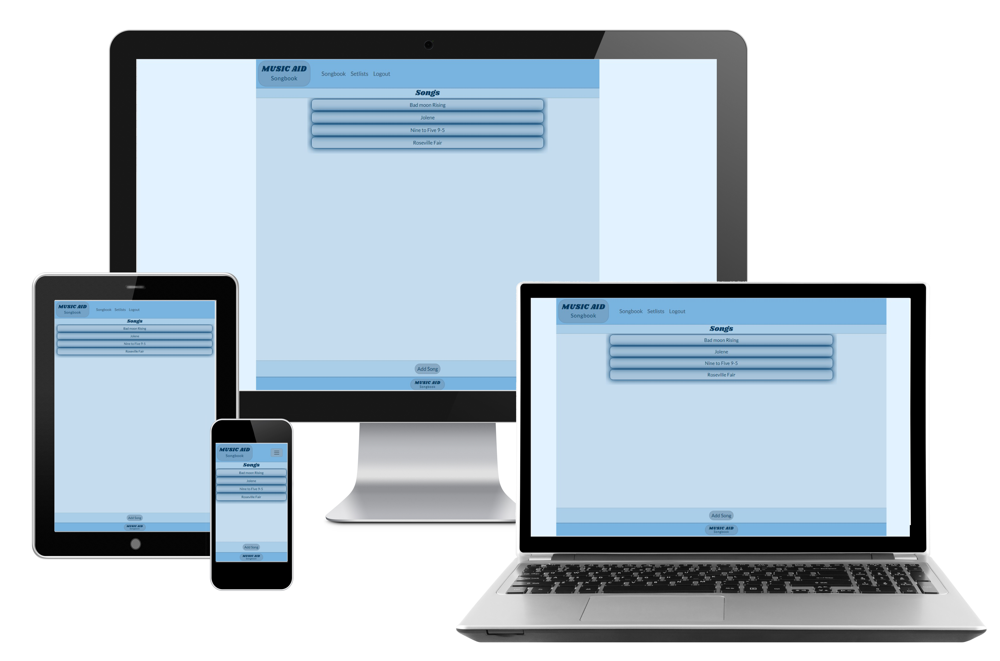

## **Contents**

1 [Project Initiation](#1-project-initiation)

2 [Music Aid : Songbook development](#2-music-aid--songbook-development)

3 [Instructions](#3-instructions)

4 [Features](#4-features)

5 [Testing](#5-testing)

6 [Project Sign Off](#6-project-sign-off)

7 [Releases](#7-releases)

8 [Deployment](#8-deployment)

9 [Technologies Use](#9-technologies-used)

10 [Credits](#10-credits)

## **1. Project Initiation**

 - ## Agile

    - ### Epics, User Stories and Tasks

        An agile approach was taken to the planning and implementation of the project. Epics were identified for the project from the basic requirement for an internet based, digital songbook. The epics were then refined into user stories, their associated tasks and the acceptance criteria for the features developed to satisfy the user stories.

        As the project was planned, it was ensured that there was no functionality duplicated across features and that code could be reused wherever possible.

        Note: During the planning and refinement phase, some features were combined with others and the feature ids of the features no longer required were removed from use, hence there are gaps in the feature id numbering system. No feature that is a requirement of the system has been omitted from the documentation.

    - ### MoSCow

        Once the design planning had taken place, the number of story points to be allocated to each user story was estimated based on its tasks complexity and size. Potential users of the site were consulted to help ascertain each of the user stories relative importance and, using the MoSCoW technique, were given a priority of 'must have', 'should have' or 'could have'. There were no ‘won't have’ user stories.

    - ### Agile tools

        Tools in GitHub were used to manage the project development phase. The user stories were entered as issues along with their associated tasks and acceptance criteria as well as the acceptance criteria for the features developed to satisfy the user stories.

        The user stories were given labels that indicated the epic they belonged to, their MoSCoW rating and the number of Fibonacci scaled story points that they had been allocated. 

        Initially the user stories (issues) were placed on the product backlog (implemented using a milestone) and were then moved onto the project Iteration 1 milestone when it was decided that they would be worked on during that iteration. The iteration was a 3 week period. 

        During the Iteration, the user stories were managed in a GitHub project on a kanban board. In a logical order, the user stories were moved from the 'ToDo' to 'In Progress' and, once complete, to 'Done. 

    - ### User Story / Task Prioritisation

        The order that the user stories were worked on was dependent on the dependencies of each of the user stories. 

        The features and functionality of user stories moved into the ‘in progress’ column were often dependent on the completion of user stories worked on before them. These dependencies were ascertained during the project initiation/planning stage and the additional acceptance criteria required for each feature for the user story in question were appended to those defined for the user stories developed beforehand. By appending all new requirements to the bottom of the list of previous feature acceptance criteria, a full set of feature acceptance criteria was developed. 

    - ### Acceptance Tests

        From this full feature set list and those features acceptance criteria, manual testing procedures were developed that would ascertain if the acceptance criteria for the user stories, all the features and therefore the project as a whole had been satisfied. 

        When it was believed that a user story development had been completed, the test script compiled to that point was run through to ensure that both the new set of tests for the most recent user story and those defined beforehand, for previous user stories, all passed as all the previous functionality was required for the new user story and any other user story that uses the feature the tests relate to.

## **2. Music Aid : Songbook Development**
  - ### **Website Interface Development**

    - ### Interface Mockups
        
        The interface was developed to incorporate all of the features necessary to satisfy the user stories into an easy to navigate, intuitive and aesthetically pleasing design.
	
        - [Interface Mockups](docs/pdfs/readme-interface-mockups.pdf)
	
- ### **Music Aid : Songbook Style Development**
	
    The style of the interface was decided to be minimalistic to ensure that there are few distractions from the content. This is especially important to ensure that the lyrics can be read easily.

    -	### Interface Layout
    
        The layout was inspired by other web applications, especially those used for music application, to be familiar to the user. It is consistent across pages and easy to navigate. 

        -   Header and Footer
        
            There is a fixed header and footer and the navigation menu becomes a toggle button on small screens.

        -   Main Content

            The main content is in the middle of the screen and can be scrolled if the content overflows its container. There is a button bar immediately below the content (but within the main section of the webpage) which is where any controls for the content and actions that that user can take, reside.

            The exception to the standard layout described is the auto scroll feature. This expands the lyrics to full screen whilst retaining the button bar at then bottom. The button bar is used to exit the feature should the musician wish to do so.

        -   Responsiveness
    
            The interface was designed using a mobile first approach since it the app’s main purpose is to aid a musician whilst performing and musicians will tend to use a smaller device in this scenario.
            
            On larger devices the interface populates the centre section of the screen so as not to become too large to be easily read.

            The site is responsive and elements resize as necessary to fit on the screen in use and retain usability. Words that do not fit on a single line are broken and wrap to the next line. 

    -	### Typography

        A limited set of fonts were selected for the typography of the site. This helps to ensure that the site retains a consistent, coherent feel.
	
        -   Brand and Headers:

            The brand name, ‘Music Aid’ and the headers are the google font ‘Shirkhand’. The use of this font for the brand and headers helps to establish a brand identity that can become recognisable and contributes to the coherence of the site. It is bold and easy to read at all sizes required for the site.

        -   Site Text

            Google font Lato was selected as the primary font for all text on the site that isn’t the brand name or a header. A simple font, it helps to contribute to the minimalistic, coherent feel of the site. It resizes  well and is easy to read at all sizes required for the site.

    -   ### Colour Schemes

        The colour scheme of the interface was chosen to be calming shades of blue.

        - Interface

            Light in colour, the shades of blue of the interface contrast well with the text on the site ensuring good accessibility.

            The only exception to the colour scheme of the site is the favicon which is white text on a blue background. 

        - Text

            For coherence and aesthetics, the colour of the text is a deep shade of blue. The depth of the shade was in part determined by the necessity for contrast between the text and the backgrounds for accessibility.

        -   Shading

            All colours on the site are ‘flat’ except for any drop shadows used. Drop shadows are used on hovering over link text and buttons. In the case of the song list and setlist list drop shadows are present all of the time, (not just on hover), and are used to add interest and depth to the site. 

    -   ### Images and Graphics

        With the exception of the favicon, there are no images on the site which results in the site being as fast and responsive as possible ensuring maximum usability for the user whilst performing. Images are not a requirement to satisfy any of the user stories. 

        -   Favicon

            The site favicon is a cursive S that stands for songbook. It is white on a blue background to ensure readability when small and helps to build brand identity.

    -   ### Interface styling and User Feedback:

        Features style and user feedback is consistent across the site. In all cases a successful click action is indicated by the requested action taking place.

        -   Logos
        
            The logos on the site are all the same colour and have curved corners. On hovering over the logos they turn a lighter shade of the same colour and are styled with a drop shadow to indicate to the user that the logos are interactive features and are clickable.

        -   Navigation

            -   Navigation on larger screens

                The links of the navigation bar are in a row on larger screens. The are styled with a drop shadow on hovering over them to indicate to the user that they are interactive and are clickable.

            -   Navigation on mobile devices

                The navigation becomes a drop down that is displayed when a toggle button is clicked. The styles of the links in the drop down are the same as when the navigation is viewed on larger screens and they obtain a drop shadow on hovering over them.

                The toggle button is styled like all other buttons on the site, having rounded corners and being the same colour as the other buttons. The menu toggle goes a lighter shade of the same colour and acquires a drop shadow on hovering over it.

        -   Buttons

            Buttons have curved corners and are the same colour as the menu toggle. On hovering over the buttons they go a lighter shade of the same colour and acquire a drop shadow.
        
        -   Forms

            All forms on the site are styled with Django Python package Crispy Forms. 

            The form fields obtain a drop shadow on hovering over them, To indicate that they are interactive elements.

        -   Content

            The content consists of lists and song entities.

            -   Lists

                Items in content lists are styled as individual containers as each is a unique entity. 
                
                The containers are styled with a drop shadow at all times to differentiate them from the site interface. This gives then the appearance of being outwardly curved, standing out from the page which is both aesthetically pleasing and gives the site depth. 
                
                On non touch sensitive devices, hovering over any of the list items results in the item container expands signifying it it’s interactive. 
                
                In the in the case of a touch sensitive mobile device, touching the list item will result in the list item expanding indicating a successful click.
            
            -   Songs

                The title and artist of the song are displayed with the same font as the brand name, (signifying that the information is important), and are in a container that’s a slightly deeper tone of blue than the lyric container below. 

                The lighter background colour of the containers aids accessibility which is important given it’s the data on the page that needs to be most accessible especially when reading the lyrics during a performance. 

                All the text in the lyrics container is the same size and colour so that nothing could be distracting when reading the lyrics as it’s auto scrolling.

-   ### Software Structure

    The Music Aid : Songbook internet application is implemented using the Python Django framework.

    Within the standard Django framework, this project is called ‘music aid’ and the application is called ‘songbook’.

    -   Django framework:

        Many files are installed when Django is installed. Some of these files require customisation in order that the code will run correctly for the application being developed. 

        A number of the application features are implemented with the aid of 3rd party Django packages.

        -   Django Packages / Software dependencies:

            A number of 3rd part Django packages were dependencies of project features.

            Installed Django packages: 
            
            |Package|Function|
            |-------|--------|
            |gunicorn|The webserver for Django|
            |dj database url|Allows you to utilize the 12factor inspired DATABASE_URL environment variable to configure your Django application|
            |psycogpg2|A PostgreSQL database adapter for the Python programming language|
            |dj3 cloudinary storage|Facilitates connection to a cloud based storage repository for static files|
            |Django allauth|Integrated set of Django applications addressing authentication, registration, account management|
            |Django summernote| A WYSIWYG (What You See Is What You Get) editor be used for lyric form field data entry|
            |Django crispy forms|Automatic formatting of forms for aesthetics and consistency of style|

        -   Music Aid project folder:

            The Music Aid project folder contains project wide code and configurations. Only some of the files within this folder require customisation and which ones depends on the specific project and its applications.

        -   Below are the files that were customised.
      
            |File|Function|
            |-------|--------|
            |Settings.py|Settings.py contains configurations such as debug mode, installed apps, widget, database and cloud storage configuration. The majority of setting.py is created automatically when a new Django project is created|
            |urls.py|urls.py required customisation to make use of the project songbook apps url paths. Urls.py also required customisation to the use the paths made available by the allauth and summernote 3rd party packages|

        -   Songbook Application Folder

            The songbook application folder contains all python files that are specific to the features provided by the songbook application. The songbook application provides create, read, update and delete (CRUD) functionality for songs and setlists on a per registered user basis (registration is implemented using the 3rd party allauth package). The following required creation and/or customisation:

            |File|Function|
            |-------|-------|
            |admin.py|Registration of custom models and customisation of the view of these models in the Django admin panel|
            |forms.py|Custom form classes used by the applications views to create forms within rendered templates|
            |models.py|Custom model classes that describe the database tables required, the fields within those tables and these tables and fields relationships with other tables and fields within the database as a whole. The data in these classes is used by Django to build the complete database schema required for the application|
            |urls.py|Contains definitions for all the url paths require by the application|
            |views.py|Custom classes that perform functions as required, render templates with the required data and return an http response in response to a url being requested by a site user or the system|

        -   Static Folder

            The static folder is hosted on cloud storage after deployment. It holds any static files for the application. In the songbook application the static folder contains the following folders and files:

            |Folder/File|Contents|
            |-------|-------|
            |css folder|Css styles sheets used by the site|
            |js|Javascript files and libraries used by the site|
            |favicon.ico|The sites favicon|

        -   Templates folder

            The templates folder contains custom templates used to implement the application and templates that can be customised.

        -   Procfile

            Contains a command to run the gunicorn webserver to serve the application. The command is run when the application is started.

        -   Requirements.txt

            A list of dependencies that require installation for the project to run correctly.

        -   Env.py

            Env.py contains all the environment variables for the software. It contains the data that must never be exposed in the public domain and so is never committed to a code repository.
            
            The Django ‘secret key’, the application database URL and the Cloudinary cloud storage URL are in the env.py file for use during the development phase of the project prior to deployment. At deployment, these environment variables are set within the environment on which they are deployed and are still kept out of the public domain after deployment.

    -   Database

        The database for the product is implemented using the PostgresSQL relational database management system (RDBMS).

        -   Database Data Models

            Some tables in the database are created as standard for all Django installations and some in response to the installation of some 3rd part packages. With the exception of the User table, (included with the definitions below due to its fields exposure on the front end in order to implement an authentication system), these tables are excluded from the ERD because they are implemented as standard as a result of the Django or a package installation and are not designed or modified by the Music Aid :songbook developer. 

            In response to the migration of custom models Django automatically creates various helper tables  to facilitate the relationships between the models. These helper link tables for the many to many relationships are also not included in the entity relationship diagram for the database as they were not designed or modified by the Music Aid : songbook developer. 

            The entire product database  schema can be recreated from the documented custom models and installation of Django and the documented 3rd party packages when the manage.py makemigrations and migrate commands are run.

            -   User model (A standard Django model)

                This is the default Django ‘user’ model. The fields shown below are fields installed automatically with Django and their use is handled automatically by the allauth package when the site is used by a user and Django admin should an administrator be using the admin panel for user administration.

                The user table is documented here due to some of it fields being exposed for direct data input in forms on the front end during user authentication.
            
            -   Song Model

                The song model holds data relating to any given users songs. 

                A song has a one to one foreign key relationship with the user who created it in the system. If that user is deleted, the users songs are deleted.

            -   Setlist model

                The setlist model holds data relating to any given users setlists. 

                A setlist has a one to one foreign key relationship with the user who created it in the system. If that user is deleted, the users songs are deleted.

                A users setlist has a many to many relationship with the users songs. Many songs can be linked to many setlists.

## **3. Features**

Multiple user stories are dependent on many of the features. Details of the user stories dependent on each feature are given along with links to both the user stories and the features and their respective acceptance criteria. 

Use story IDs are the format: Epic ID.User Story ID

During the planning and refinement phase, some features were combined with others and the feature ids of the features no longer required were removed from use, hence there are gaps in the feature id numbering system. No feature that is a requirement of the system has been omitted from the documentation.

-   ### **Landing Page** [Feature ‘Landing Page’ (ID1)]

    -   The ‘Landing Page’ (ID1) Feature is a dependency of all user stories

    The landing page is simple and easy to navigate and is recognisable as a conventionally designed website. 

    The landing page is responsive and will resize to fit the screen on which it is being viewed. On small screens the page content fills the entire screen and on larger screens the page width is constrained and occupies the centre section of the screen ensuring that it remains easily readable on any screen size.

    All features to be found in the landing page are detailed below. 

    -   Header, Logo and Footer

        The Header and footer are both fixed, the header to the top of the page and footer to the bottom. The header and the footer are shown on all pages of the site with the exception of the song view page when in autoscroll mode and the Django admin pages.

        The header contains the Logo for the application which is a clickable link that returns the user to the home landing page. The header also contains the navigation menu items or menu toggle, should the screen be less than 768px wide. The navigation menu is implemented with bootstrap.

    -   Main content

        -   Prior to login

            When the user is new to the system or has not yet logged in, the landing page displays a login button, to take them to the signing in page and a ‘Register’ link that would take the user to the site registration page.

        -   Post login: Songbook List [Feature ‘Songbook List’ (ID8)]

            -   ### **The ‘Songbook List’** (ID8) Feature is a dependency user stories 2.1, 2.2, 2.3, 2.4, 2.5, 2.7 

                When logged in, the landing page displays a header to inform the user that the list below is of their songs and below this, the alphabetically ordered list of the songs belonging to the logged in user. 

                When clicked, each song in the list will take the user to the ‘song view’ page for that song. 

                Should the list of songs be too long to fit on the screen the list becomes scrollable. The song containers expand to indicate that they are being hovered over aiding click with a mouse and on a mobile device they expand on click indicating that the click has been detected.
                At the bottom of the main content container and positioned immediately above the footer is the ‘button bar’. The buttons are positioned centrally in the middle of the bar for aesthetics. 

                On the landing page at the bottom of the song list there is a single button that takes the user to the add song page when clicked.

-   ### **Navigation** [Feature ‘Navigation’ (ID20)]

    -   The ‘Navigation’ (ID20) Feature is a dependency of all user stories

    On small screens (below 768px), the navigation links are hidden. They drop down from the header on click of the menu toggle. 

    On larger screen the navigation links are in a row next to the logo.

    When logged out, the navigation section contains the links ‘Register’, that takes the user to the site registration page and ‘Login’ that navigates to the site login page.

    When logged in, the navigation bar contains links to the users ‘Songbook’ (landing page), the users ‘Setlist’ page and the sites ‘Logout’ page. When logged in as an administrator, there is an additional ‘Admin’ link to the Django admin panel. 

-   ### **Register** [Feature ‘Register’ (ID3)]

    -   The ‘Register’ (ID3) Feature is a dependency of all user stories

    The ‘Register’ page can be reached by clicking the ‘Register’ link in the navigation menu when a user is not logged in.

    The ‘Register’ page has a header to inform the user what section of the site they are in and immediately below this is a message asking if they already have an account and providing a ‘sing in’ link to the ‘Login’ page. This ensures that the user is able to navigate easily to sign in should they have arrived at the sign up page accidentally.

    The sign in form is styled using crispy forms and will be easily recognisable as a form to be filled in by the user.

    Fields obtain a drop shadow on hovering over them with a mouse to indicate they’re clickable and when clicked, the clicked field gains a box shadow. 

    Validation is handled by Django based on the model defined for the user table. Entries are presence checked, range checked and type checked as appropriate for the field and its contents.

    After entering details into the fields, the user clicks the ‘sign up’ button immediately below the input fields to submit the sign in form. 

    The registration page is responsive and resizes for the screen on which it is being viewed.

-   ### **Login** [Feature ‘Sign In’ (ID2)]

    -   The ‘Sign In’ (ID2) Feature is a dependency of all user stories

    The ‘Login’ page can be reached by clicking the ‘Login’ link in the navigation menu. There is also a ‘Sign In’ link to the ‘Login’ page on the ‘Register’ page.

    The ‘Login’ page has a header to inform the user of the function of the page. 

    Below the header is a message requesting that they ‘sign up’ if they have not yet created an account. The words ‘sign up’ are a link to the ‘Register’ page.

    Below the message and link to the ‘Register’ page, the user can enter their login credentials to gain access to the system.  

    Validation is handled by Django based on the model defined for the user table. Entries are presence checked, range checked and type checked as appropriate for the field and its contents.

    Once details are entered the user can click the ‘sign in’ button to submit the form.

    If incorrect details have been entered the password field is cleared and the user can reattempt logging in.

    Under the ‘Username’ and ‘Password’ fields there is a remember me check box that can be clicked to ‘check’ or ‘uncheck’ it. When unchecked the session for the user is not kept active by Django allauth when the user leaves the site and if checked the session for the user is kept active after leaving the site.

    On entering valid login credentials and clicking the ‘sign in’ button, the user is redirected to the ‘Songs’ list (index) page.

    The ‘Login’ page is responsive and resizes for the screen on which it is being viewed.

-   ### **Logout** [Feature ‘Sign Out’ (ID6)]

    -   The ‘Sign Out’ (ID6) Feature is a dependency of all user stories

    The ‘Logout’ page can be accessed by clicking the ‘Logout’ link in the navigation menu. 

    The page has a header to inform the user of their location within the site.

    There is a large an easy to read message asking the user to confirm if they really want to sign out and immediately below this message is a button with the words ‘Sing out’ that will action the sign out procedure if clicked.

    Below the ‘Sign Out’ button there is a ‘Return Home’ link that returns the user to their ‘Songbook List’ page if clicked because they have reconsidered signing out.

    The ‘Logout’ page is responsive and resizes for the screen on which it is being viewed.

-   ### **Delete a User (Admin)** [Feature ‘Delete User’ (ID5)]

    -   The ‘Delete User’ (ID5) Feature is a dependency of all user stories

    Deletion of a user can only be accessed by a user with administrator credentials. The procedure is carried out from within the Django administration page. Should a user have administrator privileges, there is a link to the ‘Admin’ page in the navigation menu.

    Within the administration section of the site, the administrator can navigate to the ‘User’ section of the site, locate the user to be deleted and check the box next to their name and then select that they wish for the user to be deleted.

    On requesting a user deletion, the administrator is asked to confirm if they would like to action the deletion and they are informed of the data within the database that will be affected by the deletion should they wish to proceed.

-   ### **Add a Song** [Feature ‘Add Song’ (ID7)]

    -   The ‘Add Song’ (ID7) Feature is a dependency of user stories 2.1, 2.3, 2.4, 2.5, 2.7, 3.1, 3.2, 3.3, 3.4, 3.5, 3.6

    The ‘add song’ page has a header to indicate that the page is for the purpose of submitting song details.

    Below the header is a song detail entry form. 

    Except for the ‘Title’ field, validation is handled exclusively by the web browser in response to attributes inserted into the HTML by Django or on the back end by Django on form submission based on the model defined for the Song table. 

    Entries are presence checked, range checked and type checked as appropriate for the field and its contents.

    In addition to the methods described above, the title field on the form is also validated as unique within the current users songs. This validation is carried out using JavaScript and jquery ajax. On entering each keystroke, all leading and trailing white spaces are removed from the title and the title entered by the user is sent to a Django view. The Django view runs a database query to confirm whether or not the user has already used this title and returns the result to the webpage in the browser. 

    Should the title already be used by the user, the title field turns red, a message is displayed stating ‘Sorry, this title is taken’ and the ‘Save Song’ button is removed.

    If the title is available, submission of the title is allowed (subject to other Django controlled validation checks passing). 

    On clicking ‘Save Song’ leading and trailing white spaces are removed and any multiple white spaces in the data from the title field are reduced to a single space before form submission. 

    The purpose of the white space removal is to ensure that a title submitted is not the same as another title if the white spaces were to be ignored. Titles successfully submitted with multiple white spaces could be confusing to the user when looking at their song list and could result in duplicate data entry which would not be a good user experience as they will have spent time entering the details twice unnecessarily.

    Fields obtain a drop shadow on hovering over them with a mouse to indicate they’re clickable and when clicked, the clicked field gains a box shadow. The exception to this is that the lyrics textbox, which is a Summernote widget implemented using an iframe. Because it’s an iframe click events are handled by the iframe and event listeners in JavaScript and focus pseudo selectors cannot be added for the iframes contents to set the box shadow style when contents of the iframe are in focus.

    The lyrics field allows for the typing or pasting of text. On pasting into the lyric field JavaScript is used to remove any HTML tags from the pasted data ensuring only plain text is submitted to the database. The text entered into the lyrics field will retain line breaks so that they are displayed on the ‘Song View’ page in the way that the user has entered it on the ‘Add Song’ page.

    Scroll speed enables the user to select an integer speed of auto scroll from 0 to 5 inclusive. Selecting 0 indicates no auto scrolling function is desired for the song in question.

    Artist is the only optional field on the form and this is signified by the fact it has no asterisk next to the fields label.

    At the bottom of the content section of the page a button bar is present with two buttons. There is a ‘Save  Song’ button to save the song and return to the ‘song list’ page and a ‘Back to Songbook’ button that returns the user to the ‘song list’ page without saving the song. 

    The ’add song’ page is responsive and resizes as appropriate for the screen on which it is being used.

-   ### **View a Song** [Feature ‘Song View’ (ID9)]

    -   The ‘Song View’ (ID9) Feature is a dependency of user stories 2.3, 2.4, 2.5, 2.7

    The ‘Song View’ page has a header that displays the title of the song to the user. Immediately below this header a second header, with slightly smaller text, displays the artist details should they have been entered by the user on the ‘Add Song’ or ‘Edit Song’ pages. 

    Below the headers is the centrally justified lyric text. In the event that the lyric text overflows the bottom of its container, it can be accessed by scrolling.

    At the bottom of the lyrics container is a button bar. In the button bar there is a ‘Songbook’ button that will return the user to their ‘Song List’ (index) page if clicked and an ‘Edit’ button that navigates to the ‘Song Edit’ page for the song currently being viewed. 

    If an auto scroll speed of 0 is set for the song then there are no more buttons in the button bar. However, if any other speed is selected, then the button bar contains an ‘Autoscroll’ button, which initiates the auto autoscroll function if clicked and a label displaying the scroll speed set for the song being viewed.

    The ‘View a Song’ page is responsive and resizes as appropriate for the screen on which it is being used.

-   ### **Edit a Song** [Feature ‘Edit Song’ (ID10)]

    -   The ‘Edit Song’ (ID10) Feature is a dependency of user stories 2.4, 2.5

    The ‘Edit a Song’ page has a header to indicate that the page is for the purpose of submitting song details.

    The remainder of the ‘Edit a Song’ page is the same as describe in the ‘Add a Song’ section except that the song detail entry form is prepopulated with any details that were previously entered by the user for the selected song. All of these details can be edited.

    The buttons on the page are another difference between the ‘Add a Song’ page and the ‘Edit a Song’ page.

    At the bottom of the content section of the page the button bar contains three buttons. There is a ‘Save  Song’ button to save the modified details and return to the ‘song view’ page and a ‘Back to Song’ button that returns the user to the ‘song view’ page without saving the song. There is also a ‘Delete’ button that the user can click if they want to delete their song completely. 

    The ’add song’ page is responsive and resizes as appropriate for the screen on which it is being used.

    Confirm Song Deletion [Feature ‘Delete Song’ (ID11)]

    The ‘Delete Song’ (ID11) Feature is a dependency of user story 2.5

    The ‘Confirm Song Deletion’ page has a header to indicate the purpose of the page to the user.

    Below the header is a large message detailing the name of the song in question and asking the user to confirm if they’d really like to action the requested deletion.

    There is a button bar at the bottom of the main content with two buttons. Clicking or touching ‘Delete Song’ will action the deletion and clicking ‘No Thanks’ will return the user to the ‘Song Edit’ page for the song. 

-   ### **Autoscroll a Song** [Feature ‘Autoscroll’ (ID13)]

    -   The ‘Autoscroll’ (ID13) Feature is a dependency of user story 2.7

    The autoscroll function is initiated on clicking the ‘Autoscroll’ button on the song view page. Note that this button is only available if the scroll speed for the song in question is not 0.

    On clicking ‘Autoscroll’, the lyric container on the screen expands to fill the screen and 3 seconds later, if the lyrics overflow the bottom of the container, the lyrics start scrolling. The 3 second delay is to give the musician time to pick up their instrument should they be using one.

    There are 5 speed options for autoscroll set in the ‘Add a Song’ or ‘Edit a Song’ pages. 1 is the slowest speed of scroll and 5 the fastest.

    At the bottom of the autoscroll window there is a button bar. The button bar contains an ‘Exit’ button and a label displaying the selected scroll speed. 

    Clicking ‘Exit’ will exit the autoscroll feature and reset the interface. The autoscroll feature waits for the user to click ‘Exit’ before resetting the interface to ensure the user has had the time they need to finish the song.

    The autoscroll feature is responsive and resizes as appropriate for the screen on which it is being used.

-   ### **Administer a Song (Admin)** [Feature ‘Admin Page’ (ID4)]

    -   The ‘Admin Page’ (ID4) Feature is a dependency of user story 2.6

    This section shows the sections of the Django admin page that enables song Administration.

    The Django Admin pages are configured to be able to administer database song entries by  a user with administrator privileges.

    A Song can be added, edited or deleted from the admin page. Additionally, the user of a song can be changed should it become necessary.

-   ### **Setlist List** [Feature ‘Setlist List’ (ID14)]

    -   The ‘Setlist List’ (ID14) Feature is a dependency of user stories 3.1, 3.2, 3.3, 3.4, 3.5, 3.6, 3.7

    The ‘Setlist List’ page can be accessed from the navigation menu by clicking the ‘Setlists’ link. 

    There is a header indicating that the user is viewing setlists.

    Below is a list of the users setlists. They are styled in the same way as songs on ‘Songbook List’ page as described in the ‘Songbook List’ section above.

    When a set in the list is clicked, the user is taken to the ‘View a Set of Songs’ page for that set.

    At the bottom of the ‘Setlist List’ page is a button bar that contains an ‘Add Setlist’ button that navigates to the ‘Add a Setlist’ page when clicked.

-   ### **Add a Setlist** [Feature ‘Add Set’ (ID16)]

    -   The ‘Add Set’ (ID16) Feature is a dependency of user stories 3.1, 3.2, 3.3, 3.4, 3.5, 3.6, 3.8

    The ‘Add a Setlist’ page has a heading to indicated to the user that the page is for setlist detail entry.

    Below the heading is a form with a field for entering a setlist name.

    Except for the ‘setlist name’ field, validation is handled exclusively by the web browser in response to attributes inserted into the HTML by Django or on the back end by Django on form submission based on the model class defined for the Setlist table. Entries are presence checked, range checked and type checked as appropriate for the field and its contents.

    In addition to the methods described above, the setlist name field on the form is also validated as unique within the current users set of setlists. This validation is carried out using JavaScript and jquery ajax. On entering each keystroke, all leading and trailing white spaces are removed from the setlist name and the setlist name entered by the user is sent to a Django view. The Django view runs a database query to confirm whether or not the user has already used this setlist name and returns the result to the webpage in the browser. 

    Should the setlist name already be used by the user, the setlist name field turns red, a message is displayed stating ‘Sorry, this setlist name is taken’ and the ‘Save Setlist’ button is removed.

    If the setlist name is available, submission of the setlist name is allowed (subject to other Django controlled validation checks passing). On clicking ‘Save Song’ leading and trailing white spaces are removed and any multiple white spaces in the data from the setlist name field are reduced to a single space before form submission. 

    The purpose of the white space removal is to ensure that a setlist name submitted is not the same as another setlist name if the white spaces were to be ignored. Setlist names successfully submitted with multiple white spaces could be confusing to the user when looking at their setlist list and could result in duplicate data entry which would not be a good user experience as they will have spent time entering the details twice unnecessarily.

    Below the ‘setlist name’ field is a list of checkbox items. There is one checkbox for each of the user’s song. The user can ‘check’ them should they wish that song to be a member of the set being created. The user can have many sets and many of the user’s songs can belong to many of their sets. At least one song must be selected for the setlist.

    The setlist name field and the check boxes obtain a drop shadow on hovering over them with a mouse to indicate they’re clickable and when clicked, the setlist name field gains a box shadow and the check boxes become checked. 

    The form container is scrollable and can be scrolled to reach the bottom of the song list should the list be too long to fit in the form container visible on screen. 

    At the bottom of the ‘Add a Setlist’ page, there is a button bar with a ‘Save Setlist’ button that saves the entered data if valid and a ‘Back to Setlists’ button that returns the user to the ‘Setlist list’ page if clicked or touched on  a touch sensitive device.

    The ‘Add a Setlist’ page is responsive and resizes as appropriate for the screen on which it is being used.

-   ### **View a Set of Songs** [Feature ‘Setlist Song List’ (ID15)]

    -   The ‘Setlist Song List’ (ID15) Feature is a dependency of user stories 3.3, 3.4, 3.5, 3.6, 3.8

    The heading on the ‘View a Set of Songs’ page is the setlist name.

    Below the heading is a list of the songs belonging to the selected set. The list of songs is styled like the list of songs on the ‘Songbook List’ (landing) page. This list is scrollable should it overflow its container.

    On clicking a song on the list, the user is taken to the ‘View a Song From a Set’ page.

    At the bottom of the content container is a button bar two buttons. The ‘Setlists’ button returns the user to the ‘Setlist List’ page dislpaying their setlists. The ‘Edit’ button takes the user to the ‘Edit a Set’ page.

    The ‘View a Set of Songs’ page is responsive and resizes as appropriate for the screen on which it is being used.

-   ### **View a Song From a Set** [Feature ‘Setlist Song View’ (ID21)]

    -   The ‘Setlist Song View’ (ID21) Feature is a dependency of user stories 3.4, 3.8

    The ‘View a Song From a Set’ page has a heading that displays the title of the song being viewed.

    Below the title header is a lyric container displaying the selected songs lyrics. It is scrollable if the lyrics overflow their container.

    The button bar at the bottom of the lyric container has three buttons. There is a ‘Setlist’ button that returns the user to the setlist that bought them to the song being viewed. There is an ‘Edit’ button that takes the user to the ‘Edit a Song’ page and lastly, an ‘Autoscroll’ button is present that activates the autoscroll function for the song.  

    Also in the button bar is a label with the scroll speed for the selected song displayed.

    The ‘Setlist Song View’ page is responsive and resizes as appropriate for the screen on which it is being used.

-   ### **Edit a Set** [Feature ‘Edit Set’ (ID17)]

    -   The ‘Edit Set’ (ID17) Feature is a dependency of user stories 3.5, 3.6

    The ‘Edit a Set’ page is identical to the ‘Add a Setlist’ page with a couple of exceptions: 

    Fields are prepopulated with the current setlist name and the songs that are currently part of the set are checked.

    The button bar has three buttons. A ‘Back to Setlist’ button that takes the user to the ‘View a Set of Songs’ page for the setlist being edited.  There is a ‘Save Setlist’ button that saves any changes made to the setlist details and contents and there is a ‘Delete’ button that the user can click if they want to delete the setlist being edited. The delete button takes the user to the ‘Delete a Song’ page where they confirm that they’d like to action the deletion.

    The ‘Edit a Set’ page is responsive and resizes as appropriate for the screen on which it is being used.

-   ### **Delete a Set** [Feature ‘Delete Set’ (ID18)]

    -   The ‘Delete Set (ID18) Feature is a dependency of user story 3.6

    The ‘Confirm Set Deletion’ page has a header to indicate the purpose of the page to the user.

    Below the header is a large message detailing the name of the setlist in question and asking the user to confirm if they’d really like to action the requested deletion.

    There is a button bar at the bottom of the main content with two buttons. Clicking or touching ‘Delete Setlist’ will action the deletion and clicking ‘No Thanks’ will return the user to the ‘Edit a Set’ page for the setlist. 

    The ‘Confirm Set Deletion’ Page is responsive and resizes as appropriate for the screen on which it is being used.

-   ### **Autoscroll a Setlist Song** [Feature ‘Setlist Song Autoscroll’ (ID22)]

    -   The ‘Landing Page’ (ID1) Feature is a dependency of user story 3.8

    The ‘Autoscroll a Setlist Song’ feature works exactly like the ‘Autoscroll a Song’ feature, described above.

-   ### **Administer a Setlist (Admin)** [Feature ‘Admin Page’ (ID4)]

    -   The ‘Admin Page’ (ID4) Feature is a dependency of user stories 3.7

    This section shows the sections of the Django admin page that enables setlist Administration.

    The Django Admin pages are configured to be able to administer database setlist entries by a user with administrator privileges.

    A setlist can be added, edited or deleted from the admin page. Additionally, the user of a setlist can be changed should it become necessary. All necessary validation as defined in the database model classes are carried out by the Django backend or with the due to attributes in the admin page form HTML that were inserted by Django when rendering the page.

-   ### **Potential future features**

    -   Being able to share setlists with other users who are performing at the same event.

    -   A playlist function where the order in which songs are listed in a setlist is user defined and the setlist can be automatically cued up and then autoscrolled in this order at a performance.

    -   The ability to add tags to songs such as genre that can be filtered by.

    -   A search function on song and setlist lists to find songs and setlists easily when the list grows very large.

    -   Being able to upload backing tracks that can be played in synch with autoscroll for performances.

    -   Integration with Musixmatch so songs can be searched and imported into the user’s repository automatically.

## **5. Testing**

## **6. Project Sign Off**

## **7. Releases**

## **8. Deployment**

The website is hosted on [Heroku]( https://www.heroku.com/) from the main branch of the [Music Aid : Songbook Repository](https://github.com/Stephen-J-Whitaker/music-aid).

The wesbite is dependent on cloud storage provided by Cloudinary.

The website is dependent on a postgres database made available by ElephantSQL.

  **Setting up a new cloud store on Cloudinary is as follows**

  

1. Create a new account for the deployment(click to expand)

 
  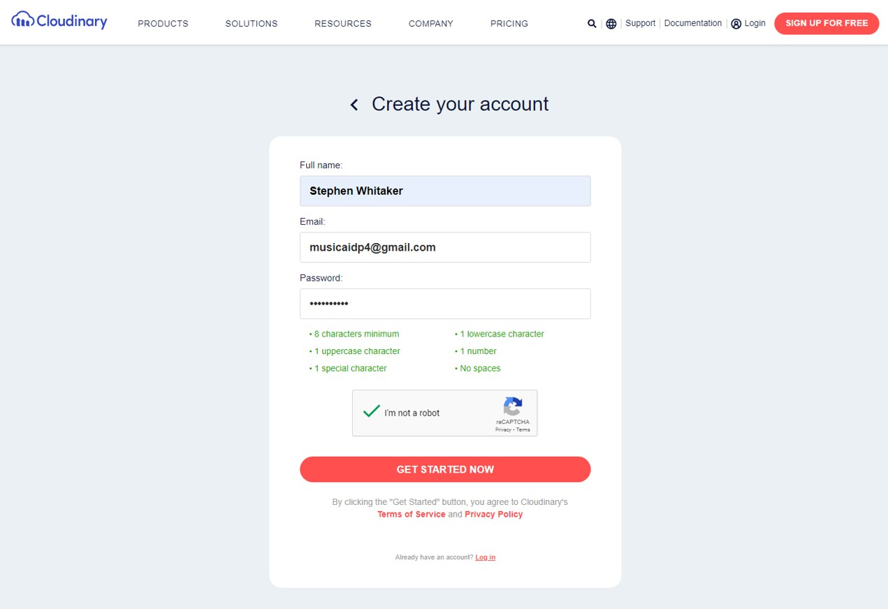
  

   

  

2. Verify your email address(click to expand)

 
  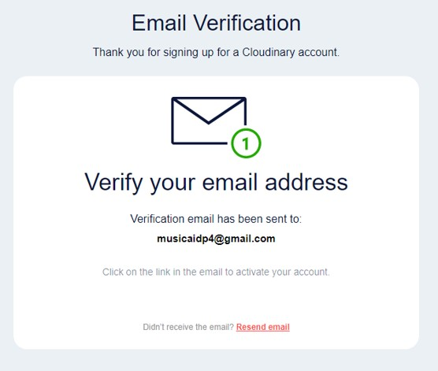
  

   
  
  

3. Choose the product you need to user(click to expand)

 
  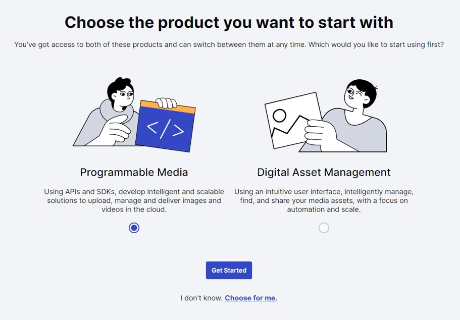
  

   

  

4. [OPTIONAL] Give the product environment cloud a name of your choosing(click to expand)

 
  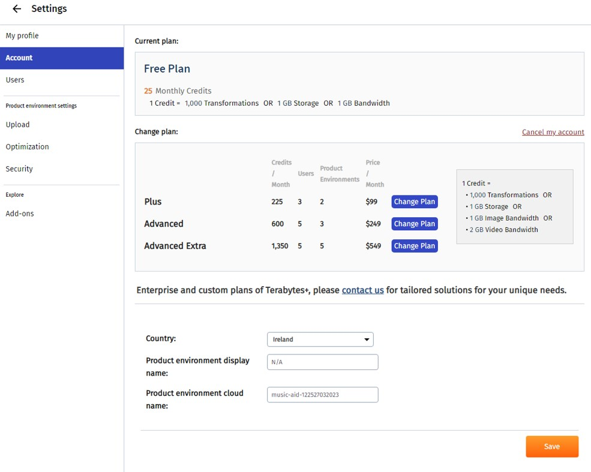
  

   

  

5. Obtain your API environment variable. The text 'CLOUDINARY_URL=' must be removed from the front of the key before it is entered into the Heroku config vars for the deployment. This key must be kept secret.(click to expand)

 
  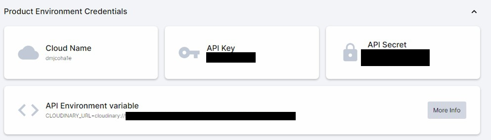
  

   

  **Setting up a new postgres database on ElephantSQL is as follows**

  

1. Sign up for an account if neceassary(click to expand)

 
  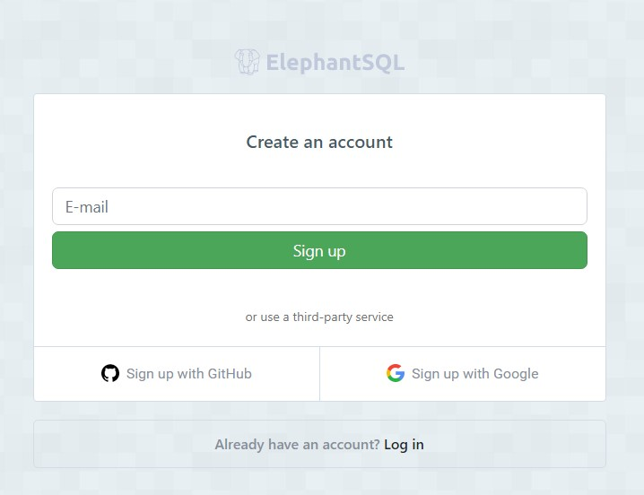
  

     

  

2. Click 'Create New Instance' (click to expand)

 
  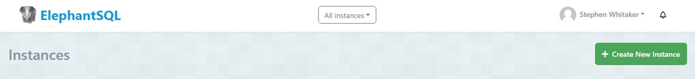
  

     

  

3. Select a plan and a name for the database instance (click to expand)

 
  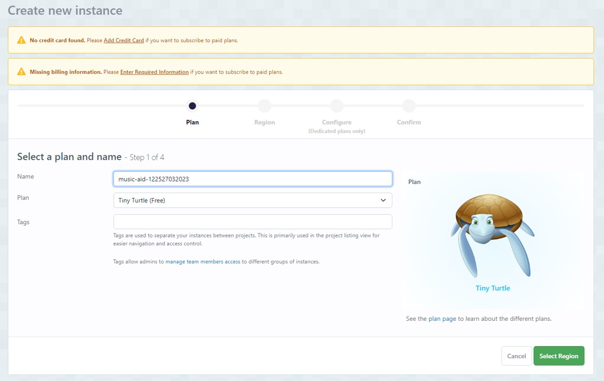
  

    

  

4. Select a region and data center (click to expand)

 
  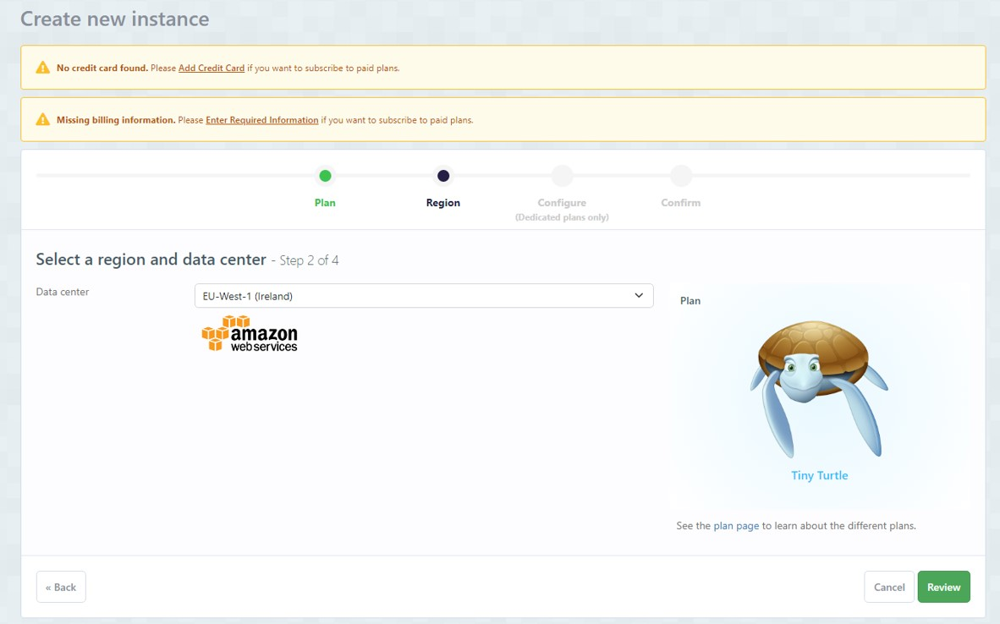
  

    

  

5. Confirm the details to create a new instance (click to expand)

 
  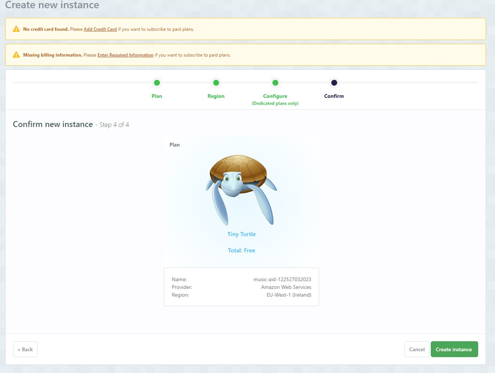
  

    

  

6. Successful creation of the instance is indicated(click to expand)

 
  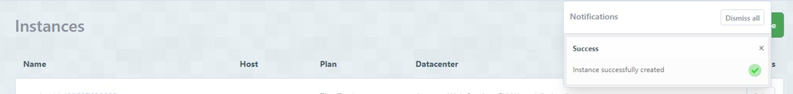
  

    

  

7. Retrieve the URL to access the database for entry as a 'config var' during Heroku deployment. This key must be kept secret.(click to expand)

 
  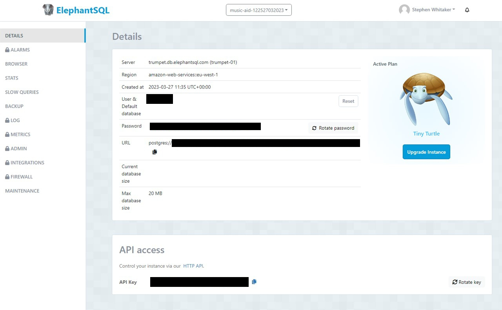
  

    

  **The Heroku deployment procedure is as follows:**
  
  

1. Log in or create a new account (click to expand)

 
  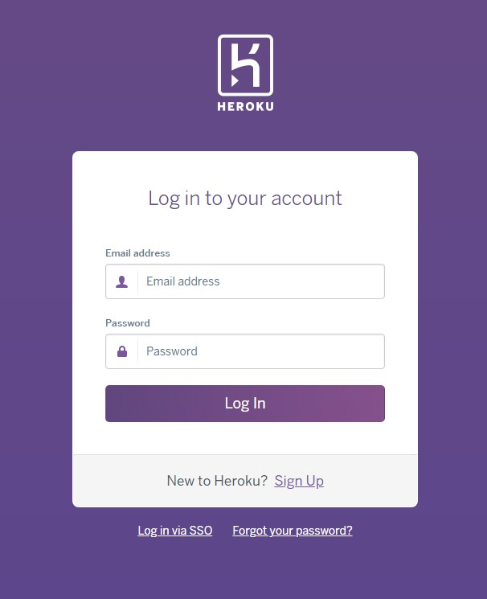
  

   

  

2. From the dashboard, select ‘Create new app’ (click to expand)

 
  
  

   

  

3. Name the app, each apps on the Heroku platform require a unique name, then select a region and click create app (click to expand)

 
  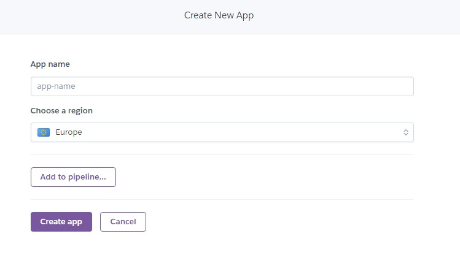
  

   

  

4. Click on ‘Settings’ in the top menu bar (click to expand)

 
  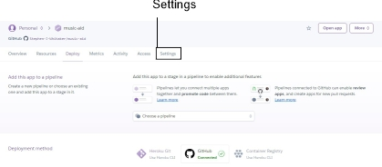
  

   

  

5. Click on ‘Reveal Config Vars’ to reveal the config var section then enter the config var details as shown in the image. When a field is complete, click the ‘ADD’ button next to the fields. New empty fields will appear below the previously entered field. When complete, click ADD. The config vars entered will be unique to the cloudinary account and database set up for your instance of the product. You must create a Django secret key that is unique. Cloud, databse and Django secret Keys must be in the format shown and must be kept secret.(click to expand)

 
  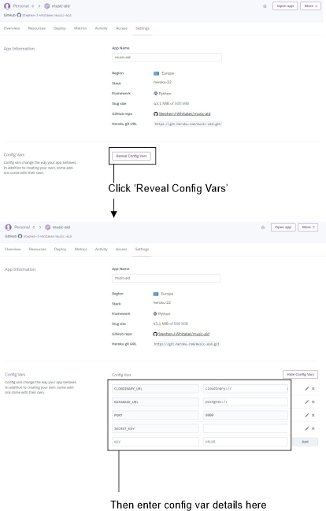
  

   

  

6. Click on ‘Deploy’ on the main menu ribbon at the top of the page and then click ‘GitHub’ (click to expand)

 
  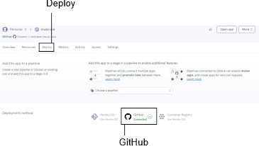
  

   

  

7. If necessary, confirm that you want to connect to GitHub by clicking ‘Connect to GitHub’ (click to expand)

 
  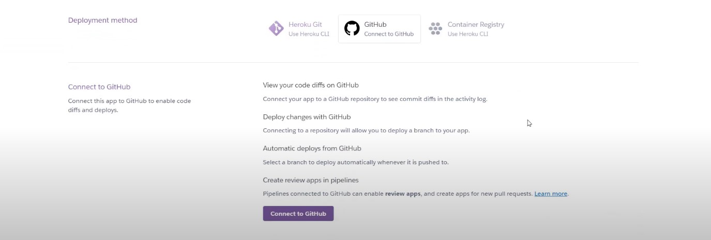
  

   

  

8. Search for the GitHub repository name (click to expand)

 
  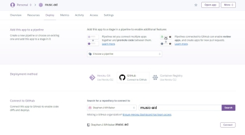
  

   

  

9. Click either ‘Enable Automatic Deploys’ which will automatically redeploy the app each time the Git repository is updated, or ‘Deploy Branch’ to deploy the app manually as requried (click to expand)

 
  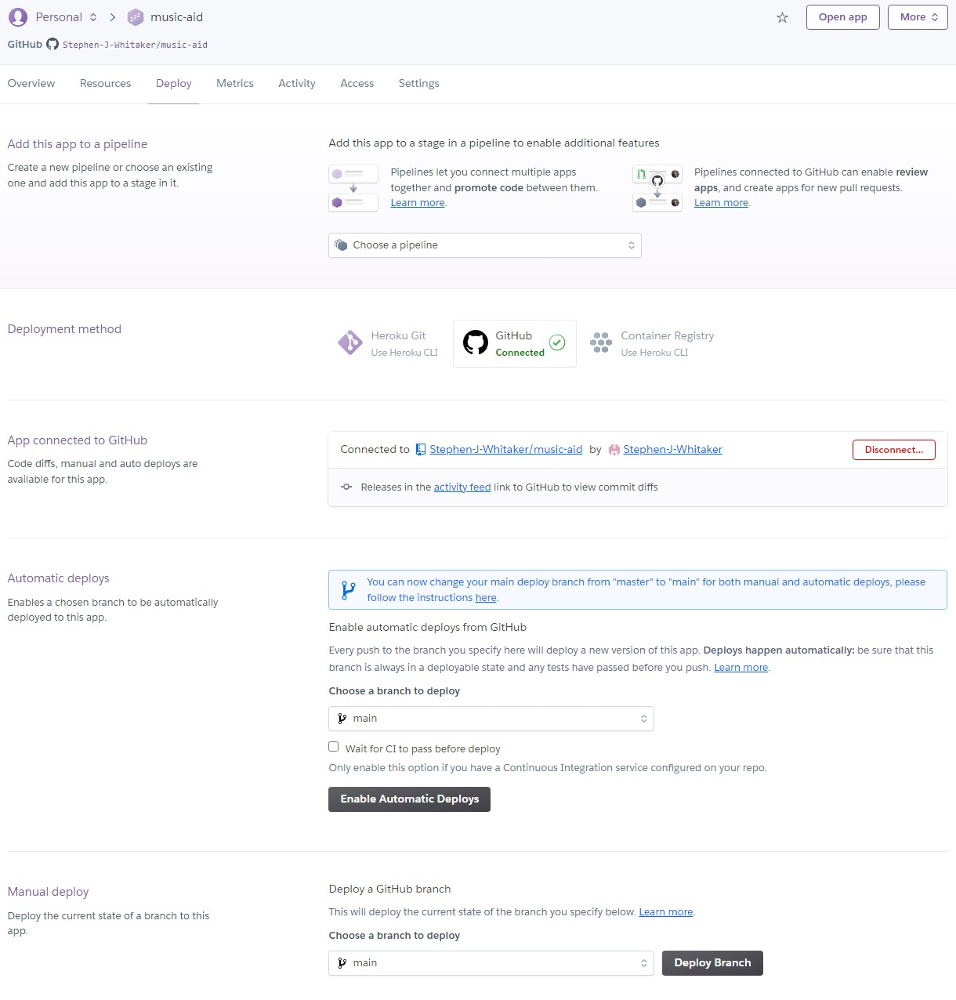
  

   

  

10. If ‘Deploy Branch’ was selected the screen will look like the following image when deployment is complete (click to expand)

 
  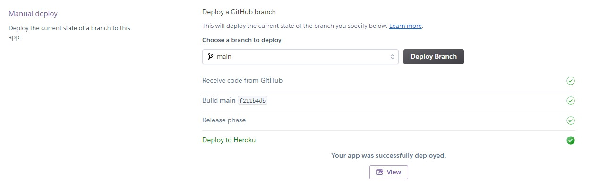
  

   

  

11. Open a console for the Heroku app (click to expand)

 
  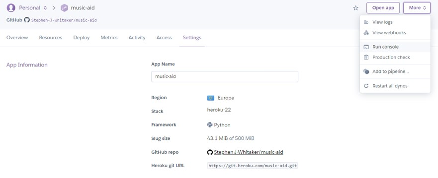
  

   

  

12. Run the migrate command to migrate the database schema defined by the migrations files to the new empty ElephantSQL database (click to expand)

 
  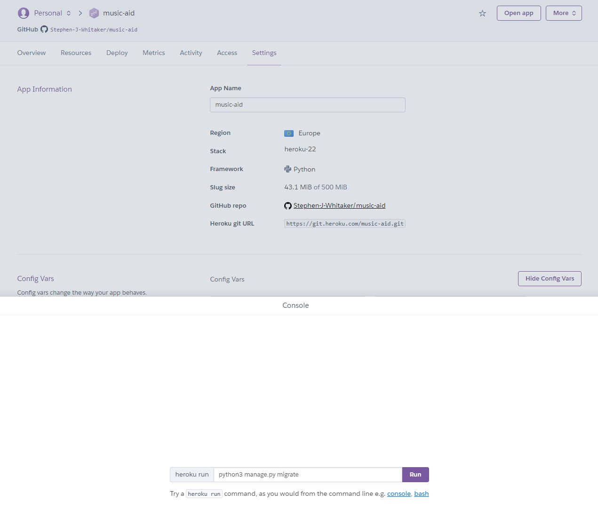
  

   

  

13. Open the app by clicking 'Open app' (click to expand)

 
  
  

     

## Forking the Repository

1.  Navigate to github and sign up or sign in
2.  Navigate to the the repository at the following link: https://github.com/Stephen-J-Whitaker/music-aid
3.  Locate the fork button at the top of the page and click it

    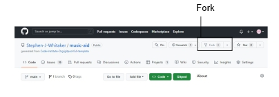

4. A copy of the repository will be made in your gitHub account

## Clone

## **9. Technologies Used**

- [Python](https://www.python.org/)

-   Django

-   HTML

-   CSS

-   JavaScript

-   ElephantSQL : Hosts a postgres database for the project

-   Cloudinary : Cloud storage for static files

-   Bootstrap : Used to implement the responsive navigation bar and a dependency of some Django packages

-   Google Fonts : Used for fonts 'Shrikhand' and 'Lato'

-   Code institute student template for GitPod: Used to install the necessary IDE tools and set up GitPod as required

-   The W3C Markup Validation Service : Used to validate the website HTML

-   The W3C CSS Validation Service - Jigsaw : Used to validate the website CSS

-   JSHint, a JavaScript Code Quality Tool (linter): Used to validate and check the styling of the website JavaScript

-   Favicon.io : Used to create the favicon for the site

-   JQuery : Used for its implemention of Ajax

-   Ajax : Used to validate data entered by the user

-   pgAdmin : Used to access the postgres database and verify create, read, update and delete was happening as required

-   [Corel Draw](https://www.coreldraw.com/en/) : Used for developing the mockups for the app

-   [Microsoft Excel](https://www.microsoft.com/en-ie/microsoft-365/excel) : Used for documenting features and recording test results

-   [Microsoft Visio](https://www.microsoft.com/en-ie/microsoft-365/visio/flowchart-software) : Used for producing Epics and User Stories

-   [Chrome](https://www.google.com/intl/en_ie/chrome/) : Used for research, development and testing (including DevTools and Lighthouse test suite)

-   [Safari](https://www.apple.com/safari/) : Used for testing

-   [Opera](https://www.opera.com/) : Used for testing

-   [Edge](https://www.microsoft.com/en-us/edge) : Used for testing

-   [Firefox](https://www.mozilla.org/en-US/firefox/new/) : Used for testing

-   [Notepad++](https://notepad-plus-plus.org/downloads/) : Used for text file editing

-   [GitPod](https://www.gitpod.io/) : Used for product development and testing

-   [GitHub](https://github.com/) : Used for accessing committed code repositories and hosting the completed product online

-   [Git](https://git-scm.com/): Used for code version control

-   [Code Institute Python Linter](https://pep8ci.herokuapp.com/#): Used to validate and check the styling of the Python code

- Windows 10 snipping tool for creating screen grabbed jpeg files for the readme

## **10. Credits**

-   All code was written by the author, Stephen Whitaker, unless explicitly stated within the code.

-   Bootstrap was used for the creation of the responsive navigation bar.

-   Code Institute Tutor Support helped me identify a class name in views.py that was the same name as and in conflict with a class in forms.py by introducing me to the Django generic create view. The code can be found in [views.py]( https://github.com/Stephen-J-Whitaker/music-aid/blob/main/songbook/views.py) for the songbook app.

-   Code to show success messages on successful deletion was obtained from stack exchange at the following link : https://stackoverflow.com/questions/24822509/success-message-in-deleteview-not-shown. The code can be found in [views.py]( https://github.com/Stephen-J-Whitaker/music-aid/blob/main/songbook/views.py) for the songbook app.

-   The configuration for messages and the JavaScript timeout function for clearing message automatically was provided by Code Institute. The code can be found in [songbook_index.js]( https://github.com/Stephen-J-Whitaker/music-aid/blob/main/static/js/songbook_js/songbook_index.js) and [Settings.py]( https://github.com/Stephen-J-Whitaker/music-aid/blob/main/music_aid/settings.py) for the music_aid project.

-   Settings for the configuration of an ElephantSQL database were provided by Code Institute. The code is in [Settings.py]( https://github.com/Stephen-J-Whitaker/music-aid/blob/main/music_aid/settings.py) for the music_aid project.

-   Settings for the configuration of cloudinary as a cloud store for static files was provided by Code Institute. The code is in [Settings.py]( https://github.com/Stephen-J-Whitaker/music-aid/blob/main/music_aid/settings.py) for the music_aid project.

-   Settings required to configure allauth were provided by Code Institute. The code is in [Settings.py]( https://github.com/Stephen-J-Whitaker/music-aid/blob/main/music_aid/settings.py) for the music_aid project and [urls.py](https://github.com/Stephen-J-Whitaker/music-aid/blob/main/music_aid/urls.py)

-   Settings required for the configuration of summernote were supplied by code institute. The code is in [Settings.py]( https://github.com/Stephen-J-Whitaker/music-aid/blob/main/music_aid/settings.py) for the music_aid project and [urls.py](https://github.com/Stephen-J-Whitaker/music-aid/blob/main/music_aid/urls.py)

-   Code to remove formatting from content pasted into summernote was adapted from code found at the following link : https://stackoverflow.com/questions/71334716. The code can be found in [admin.js](https://github.com/Stephen-J-Whitaker/music-aid/blob/main/static/js/admin_js/admin.js) and [songbook_song_add_edit.js](https://github.com/Stephen-J-Whitaker/music-aid/blob/main/static/js/songbook_js/songbook_song_add_edit.js)

-   Code to use ajax to send and receive data to and from a Django view was adapted from code at the following link : https://www.geeksforgeeks.org/handling-ajax-request-in-django/. The code can be found in [songbook_song_add_edit.js](https://github.com/Stephen-J-Whitaker/music-aid/blob/main/static/js/songbook_js/songbook_song_add_edit.js) and [songbook_setlist_add_edit.js](https://github.com/Stephen-J-Whitaker/music-aid/blob/main/static/js/songbook_js/songbook_setlist_add_edit.js)

-   Code used to reduce multiple white spaces in a string to single spaces was taken from the following site: https://www.tutorialrepublic.com/faq/how-to-replace-multiple-spaces-with-single-space-in-javascript.php. The code can be found in [songbook_song_add_edit.js](https://github.com/Stephen-J-Whitaker/music-aid/blob/main/static/js/songbook_js/songbook_song_add_edit.js) and [songbook_setlist_add_edit.js](https://github.com/Stephen-J-Whitaker/music-aid/blob/main/static/js/songbook_js/songbook_setlist_add_edit.js)

## **11. Acknowledgements**

-   A special thank you to my mentor Maranatha Ilesanmi

-   Thank you to all those who were kind enough to test the website and provide feedback